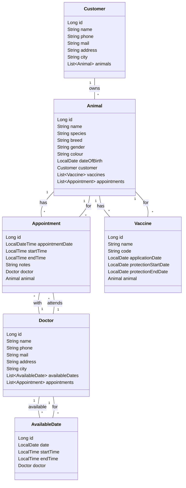

# Veterinary Management System UML Diyagramı

Aşağıda sistemin temel entity'leri ve aralarındaki ilişkileri gösteren UML diyagramı bulunmaktadır:

```mermaid
classDiagram
    class Customer {
        Long id
        String name
        String phone
        String mail
        String address
        String city
        List~Animal~ animals
    }
    class Animal {
        Long id
        String name
        String species
        String breed
        String gender
        String colour
        LocalDate dateOfBirth
        Customer customer
        List~Vaccine~ vaccines
        List~Appointment~ appointments
    }
    class Doctor {
        Long id
        String name
        String phone
        String mail
        String address
        String city
        List~AvailableDate~ availableDates
        List~Appointment~ appointments
    }
    class Appointment {
        Long id
        LocalDateTime appointmentDate
        LocalTime startTime
        LocalTime endTime
        String notes
        Doctor doctor
        Animal animal
    }
    class Vaccine {
        Long id
        String name
        String code
        LocalDate applicationDate
        LocalDate protectionStartDate
        LocalDate protectionEndDate
        Animal animal
    }
    class AvailableDate {
        Long id
        LocalDate date
        LocalTime startTime
        LocalTime endTime
        Doctor doctor
    }
    Customer "1" -- "*" Animal : owns
    Animal "1" -- "*" Vaccine : has
    Animal "1" -- "*" Appointment : has
    Doctor "1" -- "*" Appointment : attends
    Doctor "1" -- "*" AvailableDate : available
    AvailableDate "*" -- "1" Doctor : for
    Appointment "*" -- "1" Animal : for
    Appointment "*" -- "1" Doctor : with
    Vaccine "*" -- "1" Animal : for
``` 